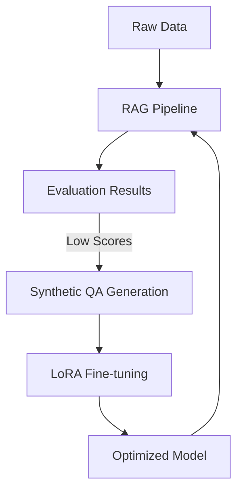

# Architectural Deep-Dive

This document outlines the software architecture of **rageval**, a framework for evaluating and optimizing RAG (Retrieval-Augmented Generation) pipelines.

## High-Level Overview

Rageval is built on a **modular architecture** that separates data ingestion, retrieval logic, generation, and evaluation. This modularity allows for the "Fine-tuning Flywheel": a continuous improvement loop where evaluation results drive dataset generation, which in turn drives model optimization.

### 1. Ingestion Layer
- **Responsibility**: Chunking raw documents and seeding the vector database.
- **Components**: `rageval/ingest.py`, `PyMuPDF` (for PDF processing), `FAISS` (vector storage).

### 2. Retrieval Layer
- **Responsibility**: Semantic search over indexed documents.
- **Components**: `rageval/retriever.py`, `SentenceTransformers` (embeddings).

### 3. Generation & Orchestration Layer (The Pipeline)
- **Responsibility**: Coordinating retrieval, prompt construction, and LLM interaction.
- **Components**: `rageval/pipeline.py`, `LiteLLM` (multi-model support).

### 4. Evaluation Layer
- **Responsibility**: Quantifying performance using objective metrics.
- **Components**: `rageval/eval.py`, `RAGAS` (Faithfulness, Relevancy, Recall).

### 5. Optimization & Fine-tuning Layer
- **Responsibility**: Addressing performance gaps through synthetic data and QLoRA.
- **Components**: `finetune/generate_data.py`, `finetune/train.py` (PEFT/TRL).

## The Fine-tuning Flywheel

## Design Principles
- **Agnosticism**: Compatible with multiple LLMs (OpenAI, Anthropic, local) via LiteLLM.
- **Reproducibility**: Integrated versioning and git tagging for evaluation runs.
- **Efficiency**: Use of QLoRA to allow fine-tuning on consumer hardware.
